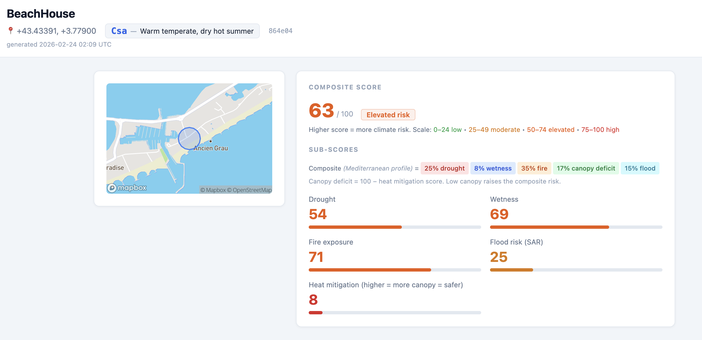

# Location Sentinel Analytics API

On-demand climate risk indicators for any location, derived from Sentinel-2 optical imagery, Sentinel-1 SAR, and TerraClimate gridded climate data. No raw imagery is stored. Everything is computed from cloud-hosted COG assets and OPeNDAP point extractions, persisted as derived features and time series, and served via a JSON API with an interactive HTML report.

---

## Table of contents

1. [What this does](#what-this-does)
2. [Architecture overview](#architecture-overview)
3. [Data sources](#data-sources)
4. [Scene selection and cloud filtering](#scene-selection-and-cloud-filtering)
5. [Cloud masking: SCL valid classes](#cloud-masking-scl-valid-classes)
6. [COG window reads](#cog-window-reads)
7. [Spectral indices](#spectral-indices)
8. [SAR flood detection](#sar-flood-detection)
9. [Derived features](#derived-features)
10. [Risk scoring](#risk-scoring)
11. [API reference](#api-reference)
12. [Quick start](#quick-start)
13. [Running locally](#running-locally)
14. [Configuration](#configuration)

---

## What this does

Given a point or polygon geometry, this service:

- Searches the Sentinel-2 L2A archive for satellite passes over that location (back 5 years by default)
- Searches the Sentinel-1 GRD archive for SAR passes over the same period
- Fetches TerraClimate monthly climate variables (temperature, precipitation, VPD, PDSI) from the University of Idaho THREDDS server
- Reads terrain elevation from a hybrid bare-earth DTM: USGS 3DEP 1" lidar (US locations) with Copernicus GLO-30 as global fallback
- Queries Overture Maps GeoParquet on S3 via DuckDB to count building footprints and compute building coverage fraction within the 640m window
- All five pipelines run concurrently; results are merged before scoring
- For each selected S2 scene: reads 64x64 native pixels (640m footprint) for 7 bands, masks bad pixels via SCL, computes six spectral indices
- For each selected S1 scene: reads 64x64 pixels of VV backscatter, applies a DN threshold to detect water
- Aggregates to monthly statistics and derives long-term features (optical, SAR, and climate) including trend slopes and 1y momentum ratios
- Scores the location across six climate risk dimensions using climate-zone-specific weights (via Köppen classification); trend-aware multipliers reflect active episodes and trajectory
- Persists all results in PostgreSQL; returns JSON and renders an HTML report with charts

Typical cold-start time (5-year window): 15-40 seconds. Cached results return instantly.



---

## Architecture overview

```
POST /v1/locations (geometry + options)
        |
        v
  Input validation + stable location key
  key = sha256(customer_id | name | lat_5dp | lon_5dp)[:6]
        |
        |-------------- asyncio.gather -------------------------------------------------|
        v                  v                        v                               v
  Sentinel-2 L2A     Sentinel-1 GRD          TerraClimate pipeline        DTM (3DEP / GLO-30)   Overture Maps
  STAC search        STAC search             OPeNDAP point extraction      DEM COG read          GeoParquet / DuckDB
  Earth Search v1    Earth Search v1         U. Idaho THREDDS              /vsis3/, no-sign      overturemaps-us-west-2
  s2-l2a collection  s1-grd collection       5 vars × N years              1 arc-sec (~30m)      theme=buildings
  sentinel-cogs      sentinel-s1-l1c         tmax tmin ppt vpd PDSI        3DEP (US) / GLO-30    pinned release
        |                  |                        |                               |                     |
        v                  v                        v                               v                     v
  Scene selection    Scene selection         DuckDB grid-cell cache        64x64 px window       ST_Intersection
  monthly best cloud IW GRD, VV asset        (1/24° ~4 km, shared)         elevation_m           footprints in window
  ≤2/month, max 120  ≤2/month, max 120       Fetch missing via OPeNDAP     elevation_min_m       building_count
        |                  |                        |                         elevation_max_m       building_fraction
        |                  |                        |                         elevation_range_m     mean_building_height_m
        |                  |                        |                         slope_deg             (cached per release)
        v                  v                        v                               |                     |
  Async COG reads    Sync VV reads via        Derive climate features:             |                     |
  7 bands, 64x64 px  rasterio WarpedVRT       tmax_mean, tmax_anomaly,            |                     |
  async-geotiff      64x64 px, UTM CRS        tmax_trend, ppt_annual,             |                     |
        |                  |                  vpd_high_freq, pdsi_freq             |                     |
        v                  v                        |                               |                     |
  SCL masking        Water detection                |                               |                     |
  NDVI NDWI NDMI     water_frac = px < 75 DN        |                               |                     |
  NBR NDSI BSI       (excl. nodata DN=0)            |                               |                     |
        |                  |                        |                               |                     |
        v                  |                        |                               |                     |
  Monthly aggregation + Snow suppression:           |                               |                     |
  long-term features   excl. months NDSI > 0.4     |                               |                     |
        |                  |                        |                               |                     |
        |<--------- merge optical + SAR + TerraClimate + DEM + buildings features ---------------------||
        |
        v
  Climate zone lookup (centroid → Köppen code)
        |
        v
  Risk scoring (drought, wetness, fire, heat mitigation, flood, heat stress)
  Composite: 40% climate-zone-weighted average + 60% dominant sub-score
  Urban branch: same blended formula over canopy deficit / wetness / flood / heat stress
        |
        v
  PostgreSQL persistence (features, timeseries, scores, band arrays, SAR arrays,
                         TerraClimate monthly cache)
        |
        v
  JSON response + HTML report (optical charts + SAR chart + climate charts)
```

---

## Data sources

### Sentinel-2 L2A

**Satellite:** ESA Sentinel-2A + 2B twin constellation
**Revisit:** 5 days at equator (2-3 days effective with both satellites)
**Resolution:** 10m for visible/NIR bands, 20m for SWIR and SCL
**Product level:** L2A (bottom-of-atmosphere reflectance, atmospherically corrected)
**Archive:** AWS Earth Search v1 (`https://earth-search.aws.element84.com/v1`)
**Collection:** `sentinel-2-l2a`
**S3 bucket:** `sentinel-cogs` (us-west-2), public, no authentication required

Bands used:

| Band | Name | Resolution | Used for |
|------|------|-----------|---------|
| B02 | Blue | 10m | BSI |
| B03 | Green | 10m | NDWI, NDSI |
| B04 | Red | 10m | NDVI, BSI |
| B08 | NIR | 10m | NDVI, NDWI, NDMI, NBR, BSI |
| B11 | SWIR1 | 20m | NDMI, NDSI, BSI |
| B12 | SWIR2 | 20m | NBR |
| SCL | Scene Classification | 20m | Cloud / quality mask |

---

### Sentinel-1 GRD (SAR)

**Satellite:** ESA Sentinel-1A + 1B C-band SAR constellation
**Mode:** IW (Interferometric Wide Swath), GRD product (Ground Range Detected)
**Revisit:** ~6 days
**Resolution:** 10m pixel spacing (true resolution ~20m)
**Cloud penetration:** SAR microwaves pass through clouds -- valid observations in any weather
**Archive:** AWS Earth Search v1
**Collection:** `sentinel-1-grd`
**S3 bucket:** `sentinel-s1-l1c` (eu-central-1), public, no authentication required
**Asset used:** `vv` (VV polarization, uint16 DN)

**Why SAR for flood detection:** Water surfaces are specular reflectors -- VV microwave energy bounces away from the sensor, producing very low backscatter (low DN values). Land surfaces (soil, vegetation) scatter back much more energy. This gives a reliable water/no-water signal that optical indices cannot provide under cloud cover.

**DN calibration (empirical for sentinel-s1-l1c IW GRD):**

| Surface type | DN range | dB (approx) |
|-------------|----------|-------------|
| Thermal noise floor | ~35 DN | ~-52 dB |
| Calm open water | 35-70 DN | -52 to -45 dB |
| Vegetated land | 100-250 DN | -43 to -37 dB |
| Urban / corner reflectors | 500+ DN | > -30 dB |

Conversion: `sigma0_dB ≈ 20 * log10(DN) - 83`

Current threshold: `SAR_WATER_DN_THRESHOLD = 75` (above noise floor, below land mean). A pixel is classified as water when `0 < DN < 75`. A scene is classified as flooded when at least 35% of the **flat-terrain** pixels in the 64x64 window meet this criterion (`SAR_MIN_WATER_PIXEL_FRACTION = 0.35`).

**DEM slope mask (v1.26.0):** SAR backscatter on steep slopes is geometrically dependent on look angle and can produce low-DN returns that mimic open water. Before computing any per-scene water fraction, pixels where the DEM-derived slope exceeds `DEM_FLAT_SLOPE_THRESHOLD` (15°) are excluded from both the numerator (water pixels) and denominator (valid pixels). This corrects inflated water fractions at mountain valley and alpine sites without affecting flat terrain where the threshold has no effect. The slope is computed via `numpy.gradient` on the cached 64x64 elevation array using the 10 m pixel spacing.

For the chronic frequency metric two thresholds are evaluated per orbit and the higher frequency is returned:

- **Absolute:** scene water fraction > 35% (fixed). Works well for inland and open-water locations. No consecutive requirement -- permanent water bodies are real by definition.
- **Adaptive (MAD-based):** per orbit, `threshold = max(median + SAR_FLOOD_MAD_K × MAD, SAR_MIN_ANOMALY_FRACTION)`. Anomalous scenes are only counted when they form a run of at least `SAR_MIN_CONSECUTIVE_FLOOD_MONTHS` (default 2) calendar-consecutive months, suppressing single-pass instrument noise (wind roughening, brief specular glint) while preserving multi-pass genuine flood events.

`sar_water_freq_5y = max over orbits of max(absolute_freq, anomaly_freq)`

---

### Elevation DEM (hybrid: USGS 3DEP + Copernicus GLO-30)

For US locations (lat 18-72°N, lon 180-64°W), the USGS 3DEP 1" bare-earth lidar DTM is tried first. Outside the US, or if the 3DEP tile is missing/insufficient, the Copernicus GLO-30 DSM is used as the global fallback.

**USGS 3DEP (US primary):**
**Product:** USGS 3D Elevation Program, 1 arc-second (~30m), lidar bare-earth DTM
**Archive:** AWS S3 `s3://prd-tnm/` (us-west-2), public, no authentication
**Tile path:** `StagedProducts/Elevation/1/TIFF/current/n{lat}w{lon}/USGS_1_n{lat}w{lon}.tif`

**Copernicus GLO-30 (global fallback):**
**Product:** Copernicus Digital Elevation Model, 30m (1 arc-second) global DSM
**Source:** TanDEM-X radar acquisition; vertical accuracy ~1 m RMSE over flat terrain
**Archive:** AWS S3 `s3://copernicus-dem-30m/` (eu-central-1), public, no authentication
**Access pattern:** Single 64x64 pixel window read per location; result cached permanently in DuckDB

One 1°x1° tile is opened per location. GLO-30 tile path convention:
```
Copernicus_DSM_COG_10_{N|S}{lat:02d}_00_{E|W}{lon:03d}_00_DEM/{tile}.tif
```

Five terrain features are derived from the 64x64 window (640m x 640m footprint):
- `elevation_m` -- mean ellipsoidal elevation in metres
- `elevation_min_m` -- minimum elevation within the window
- `elevation_max_m` -- maximum elevation within the window
- `elevation_range_m` -- `elevation_max_m − elevation_min_m` (terrain relief proxy)
- `slope_deg` -- mean slope angle in degrees, computed from numpy central-difference gradient scaled by arc-second pixel size in metres

---

### Overture Maps (building footprints)

**Provider:** Overture Maps Foundation
**Release:** Pinned at `OVERTURE_RELEASE` (default `2026-02-18.0`); update by running `aws s3 ls s3://overturemaps-us-west-2/release/ --no-sign-request`
**Coverage:** Global
**Format:** GeoParquet partitioned by theme/type, hosted on public S3 (`overturemaps-us-west-2`, us-west-2)
**Access:** DuckDB with `httpfs` and `spatial` extensions; no authentication required

Three building features are derived per location:

| Feature | Description |
|---------|-------------|
| `building_count` | Integer count of Overture building footprints intersecting the 640m window |
| `building_fraction` | Sum of clipped footprint area / 409,600 m² (range 0–1) |
| `mean_building_height_m` | Mean height from Overture attribute (sparse; often null for low-coverage regions) |

`building_fraction` formula: `Σ ST_Area(ST_Intersection(geometry, window_envelope)) × deg_to_m² scale / 409,600 m²`.

Results are cached in the `buildings_cache` table keyed on `(location_key, overture_release)` -- independent of `PROCESSING_VERSION`, so bumping the processing version does not re-query Overture.

---

### NOAA CO-OPS (tidal stations and predictions)

**Provider:** NOAA Center for Operational Oceanographic Products and Services
**Coverage:** ~1,000 active US water-level tidal stations
**Metadata API:** `https://api.tidesandcurrents.noaa.gov/mdapi/prod/webapi/stations.json?type=waterlevels`
**Predictions API:** `https://api.tidesandcurrents.noaa.gov/api/prod/datagetter` (hourly, MSL datum, GMT)

On startup the service fetches the full station list (tidal stations only) and caches it in DuckDB. A site is classified as a **tidal zone** when the nearest tidal station is within `TIDAL_ZONE_RADIUS_KM` (default 30 km) **and** `elevation_m ≤ TIDAL_ZONE_MAX_ELEV_M` (default 10 m). The elevation gate prevents hillside or upland locations from being classified as tidal even when a NOAA station is geographically nearby. For tidal zone sites, the HTML and JSON reports cross-reference each Sentinel-1 SAR scene acquisition time (parsed from the scene ID filename) with the predicted MSL tide level at the nearest station, linearly interpolated to the exact acquisition minute. Tide predictions are cached permanently in DuckDB (they are deterministic and never change for past dates).

The station list is refreshed every `NOAA_STATION_REFRESH_DAYS` days (default 30). If NOAA is unreachable at startup, existing cached stations are used and the service starts normally.

---

### TerraClimate (monthly gridded climate)

**Provider:** University of Idaho Climatology Lab / Northwest Knowledge Network
**Resolution:** 1/24° (~4 km), global
**Cadence:** Monthly
**Coverage:** 1958-2024
**Access:** OPeNDAP point extraction via THREDDS server (no full file download; each request returns 12 monthly values, ~1 KB)

Variables fetched:

| Variable | Key | Unit | CF decode |
|----------|-----|------|-----------|
| Max temperature | `tmax` | °C | raw × 0.01 − 99 |
| Min temperature | `tmin` | °C | raw × 0.01 − 99 |
| Precipitation | `ppt` | mm | raw × 0.1 |
| Vapor pressure deficit | `vpd` | kPa | raw × 0.01 |
| Palmer Drought Severity Index | `PDSI` | dimensionless | raw × 0.01 − 45 |

Grid cell coordinates are snapped to the nearest 1/24° center before querying. The DuckDB `terraclimate_monthly` table acts as a persistent grid-cell-keyed cache: a cell is fetched once and reused for all locations that fall within it. Cold-start addition per new grid cell: 2-4 seconds (25 concurrent OPeNDAP requests).

Grid cell centre coordinates are snapped to the nearest 1/24° before querying. The PostgreSQL `terraclimate_monthly` table acts as a persistent grid-cell-keyed cache: a cell is fetched once and reused for all locations within it.

---

### Köppen-Geiger classification

**Source:** Beck et al. (2023) 1 km global Köppen-Geiger COG
**Resolution:** 1 km (native); single-pixel point extraction at the location centroid
**Access:** Private S3 COG (`KOEPPEN_COG_URL`), read at pipeline time via async-geotiff + obstore
**Coverage:** Global; classification codes per the standard five-letter Köppen system

The classification code is extracted at pipeline time during feature computation and passed to `save_geometry`. The `climate_descriptions` table (human-readable labels and zone criteria) remains in PostgreSQL; the old `climates` table (which stored the 0.5° flat-file grid) has been removed.

**Motivation for upgrading from the 0.5° grid:** The previous source misclassified locations on islands with steep orographic rainfall gradients. For example, leeward Maui was classified as Af (tropical rainforest) instead of BWh/BSh (hot arid), causing the composite score to use tropical-zone weights that substantially overweight wetness risk while underweighting drought and heat stress.

**Citation:**
Beck, H. E., T. R. McVicar, N. Vergopolan, A. Berg, N. J. Lutsko, A. Dufour, Z. Zeng, X. Jiang, A. I. J. M. van Dijk, and D. G. Miralles. High-resolution (1 km) Köppen-Geiger maps for 1901-2099 based on constrained CMIP6 projections. *Scientific Data* 10, 724 (2023).

---

## Scene selection and cloud filtering

### Step 1: STAC metadata pre-filter (Sentinel-2)

1. Query STAC with a server-side `eo:cloud_cover < 80` filter to skip heavily clouded scenes before any S3 read
2. Group by calendar month
3. Sort remaining scenes by `eo:cloud_cover` (ascending)
4. Keep up to `MAX_SCENES_PER_MONTH` (default 2) per month
5. Hard cap at `MAX_TOTAL_SCENES` (default 120) across the full date range

The STAC fetch uses a separate `STAC_MAX_ITEMS = 2000` budget, deliberately decoupled from `MAX_TOTAL_SCENES`. MPC returns items newest-first; a low fetch budget in dense-overpass areas (6-8 tiles/month) would exhaust the budget before reaching older years, silently truncating the analysis window to 2-3 years. The 2000-item budget provides headroom for 5 years at any global overpass density.

### Step 2: Per-pixel SCL masking

After reading the SCL band, each pixel is evaluated against the valid class list. Invalid pixels are excluded from all index computations.

### Step 3: Scene rejection

If fewer than `MIN_VALID_PIXEL_FRACTION` (default 5%) of pixels survive the mask, the scene is discarded entirely.

### Sentinel-1 scene selection

SAR has no cloud cover to filter on. Selection criteria:
- IW mode GRD products only
- VV asset must be present
- One scene per (relative orbit, month): guarantees orbital diversity without redundant same-pass scenes
- Up to `SAR_MAX_SCENES_PER_MONTH` (default 2) distinct orbits kept per month
- Hard cap at `SAR_MAX_TOTAL_SCENES` (default 120)

---

## Cloud masking: SCL valid classes

| SCL class | Label | Treatment |
|-----------|-------|-----------|
| 0 | No data | Masked |
| 1 | Saturated / defective | Masked |
| 2 | Dark area pixels | **Valid** |
| 3 | Cloud shadows | Masked |
| 4 | Vegetation | **Valid** |
| 5 | Not vegetated (bare soil, urban) | **Valid** |
| 6 | Water | **Valid** |
| 7 | Unclassified (low cloud prob) | **Valid** |
| 8 | Cloud medium probability | Masked |
| 9 | Cloud high probability | Masked |
| 10 | Thin cirrus | Masked |
| 11 | Snow / ice | **Valid** |

Class 2 (dark area pixels -- dark vegetation, shaded slopes, dark soils) is included as valid: these are genuine land surface observations, not cloud artifacts. Class 11 (snow) is included to preserve winter scenes for alpine and high-latitude locations and enable NDSI computation.

---

## COG window reads

### Sentinel-2 (async-geotiff / obstore)

1. Parse S3 key from STAC asset HTTPS href
2. Open the COG header via async-geotiff (obstore backend, anonymous S3)
3. Project the input point from WGS84 to the scene's native UTM CRS
4. Read a fixed-size window centered on that point:
   - 10m bands (B02, B03, B04, B08): 64x64 native pixels = 640m x 640m footprint
   - 20m bands (B11, B12, SCL): 32x32 native pixels = same 640m footprint, then expanded to 64x64 by 2x pixel block repeat for array alignment

All bands for a scene are read concurrently (up to `MAX_CONCURRENT_COG_READS = 32`).

### Sentinel-1 (rasterio WarpedVRT)

S1 GRD Level-1 files use GCP-based geolocation (no affine transform). Standard window reads fail on these. The pipeline uses rasterio `WarpedVRT` to warp the data into UTM CRS, creating a virtual raster with a proper affine transform from which a normal window read can proceed.

Reads run synchronously in an asyncio executor thread pool.

### Band cache

All 64x64 arrays are stored in DuckDB after the first read (`FLOAT[4096]` column). Subsequent requests for the same location reuse stored arrays with no S3 traffic.

---

## Spectral indices

All indices produce values in approximately [-1, +1]. Computed pixel-by-pixel across the 64x64 array, then spatially averaged (NaN/masked pixels excluded).

### NDVI -- Normalized Difference Vegetation Index

```
NDVI = (B08 - B04) / (B08 + B04)
```

Healthy dense vegetation: 0.6-0.9. Bare soil, urban: < 0.1. Water / snow: < 0.

---

### NDWI -- Normalized Difference Water Index (McFeeters 1996)

```
NDWI = (B03 - B08) / (B03 + B08)
```

Open surface water detection. Water reflects green, absorbs NIR. Values > 0 indicate surface water. Targets open water bodies (not vegetation moisture -- see NDMI). Locked as McFeeters formulation in `processing_version s2l2a-v1.4.0`.

---

### NDMI -- Normalized Difference Moisture Index

```
NDMI = (B08 - B11) / (B08 + B11)
```

Leaf and canopy water content using NIR and SWIR1. Sensitive to vegetation moisture stress, not open water. Values < 0 indicate moisture deficit.

---

### NBR -- Normalized Burn Ratio

```
NBR = (B08 - B12) / (B08 + B12)
```

Detects burned areas. Healthy vegetation: high NIR, low SWIR2 (NBR > 0.3). Burned surfaces lose NIR and gain SWIR2 (NBR < 0.1). Note: urban impervious surfaces (concrete, asphalt) spectrally resemble burned areas; fire exposure is suppressed to 0 for urban locations.

---

### NDSI -- Normalized Difference Snow Index

```
NDSI = (B03 - B11) / (B03 + B11)
```

Snow detection. Snow reflects green strongly, absorbs SWIR almost completely. Values > 0.4 indicate snow/ice.

NDSI months are used for SAR snow suppression: SAR scenes from months where NDSI > 0.4 are excluded from the chronic water frequency calculation, because smooth compacted snow is also specularly reflective and can mimic water. The anomaly-based flood metric does not apply this filter.

---

### BSI -- Bare Soil Index

```
BSI = (B11 + B04 - B08 - B02) / (B11 + B04 + B08 + B02)
```

Multi-band bare soil detection. SWIR1 and Red are bright for bare soil; NIR and Blue are suppressed. Values > 0 indicate exposed bare soil.

BSI frequency is also used for urban detection: locations where BSI > 0 in a high fraction of months are flagged as urban/impervious, triggering a different scoring branch.

---

## SAR flood detection

### Two complementary metrics

**Chronic: `sar_water_freq_5y`**
Fraction of SAR scenes (after snow and burn suppression, stratified by relative orbit) where the water pixel fraction exceeds the flood threshold. Two thresholds are evaluated per orbit -- absolute (35%) and adaptive MAD-based -- and the higher frequency is returned. See [SAR calibration](#sentinel-1-grd-sar) for rationale. Measures persistent or recurring water over the full 5-year window.

**Acute: `sar_flood_anomaly`**
Compares each recent scene's water fraction (last 2 calendar months) to the orbit-stratified historical seasonal baseline: the median for the same (relative orbit, calendar month) combination in prior years, with a fallback to an orbit-agnostic baseline when historical data is sparse. Returns the peak excess above the seasonal baseline, clamped to [0, 1]. Detects sudden flood events not captured by the chronic metric.

### Why two metrics?

NDSI snow suppression removes SAR scenes from months with heavy snow cover. In agricultural floodplains, freshly flooded fields trigger NDSI > 0.4 (identical specular signature). This means the chronic metric (`sar_water_freq_5y`) can miss the exact months when flooding occurred. The anomaly metric uses all SAR scenes (no snow filter) and compares against the seasonal baseline, so it catches acute events even when snow suppression is active.

### Flood risk score

```
flood_risk_score = max(sar_water_freq_5y, sar_flood_anomaly) * 100
```

The higher of the two components drives the score. Not suppressed for urban locations.

If no SAR data is found (geometry outside Sentinel-1 coverage), both metrics are `None`, `flood_risk_score = 0`, and the `no_sar_data` flag is set in quality.

---

## Derived features

Long-term features computed from the full date window (default 5 years):

| Feature | Description |
|---------|-------------|
| `ndvi_mean_5y` | Mean NDVI across all valid observations |
| `ndvi_trend_slope_5y` | Theil-Sen slope, NDVI units/year (negative = declining) |
| `ndvi_anomaly_freq_5y` | Fraction of months > 0.1 NDVI below that month's historical mean |
| `ndvi_momentum_ratio_1y` | Ratio of anomaly frequency in the last 12 months vs. 5y baseline; > 1.0 = worsening trend |
| `ndwi_wetness_persistence_5y` | Fraction of months with NDWI > 0 (surface water present) |
| `ndwi_trend_slope_5y` | Theil-Sen slope of NDWI, index units/year (positive = wetter trend) |
| `ndmi_mean_5y` | Mean NDMI over the period |
| `ndmi_moisture_stress_freq_5y` | Fraction of months with NDMI < 0 (vegetation moisture stress) |
| `ndmi_trend_slope_5y` | Theil-Sen slope of NDMI, index units/year (negative = moisture stress trend) |
| `ndmi_momentum_ratio_1y` | Ratio of NDMI anomaly frequency in the last 12 months vs. 5y baseline |
| `nbr_mean_5y` | Mean NBR over the period |
| `nbr_burn_freq_5y` | Fraction of months where NBR drops anomalously below the site's seasonal climatology (anomaly-based, requires ≥ NBR_MIN_CONSECUTIVE consecutive months) |
| `ndsi_snow_persistence_5y` | Fraction of months with NDSI > 0.4 (snow covered) |
| `bsi_mean_5y` | Mean BSI over the period |
| `bsi_bare_soil_freq_5y` | Fraction of months with BSI > 0 (bare soil exposed) |
| `canopy_proxy` | Peak growing-season NDVI; season window is Köppen + hemisphere aware |
| `is_urban` | 1.0 if location classified as urban/impervious, 0.0 otherwise; primary signal is `building_fraction` from Overture Maps (> 0.10 → urban, < 0.02 → non-urban veto); BSI spectral paths are fallback when Overture data is unavailable |
| `is_tidal_zone` | 1.0 if a NOAA tidal station is within `TIDAL_ZONE_RADIUS_KM` (30 km), 0.0 otherwise |
| `nearest_tidal_station_km` | Distance in km to the nearest NOAA tidal station, or null if none within radius |
| `sar_water_freq_5y` | SAR: fraction of scenes (snow-suppressed) with water pixel fraction > threshold |
| `sar_flood_anomaly` | SAR: max water fraction excess above seasonal median in recent months |
| `building_count` | Count of Overture Maps building footprints intersecting the 640m window |
| `building_fraction` | Sum of clipped footprint area / 409,600 m² (0–1); primary urban detection signal |
| `mean_building_height_m` | Mean building height from Overture attribute (sparse; often null) |
| `active_flood` | 1.0 if `sar_flood_anomaly > 0.10` AND corroborated by independent evidence: NDWI persistence > 0.08, OR anomaly > 0.35 with any optical water history (blocked when `sar_water_freq_5y > 0.50` and NDWI < 0.08, indicating SAR look-angle terrain artifacts); triggers a 1.40× boost to `flood_risk_score` |
| `active_fire` | 1.0 if any consecutive-confirmed NBR burn month falls within 3 months of `date_end`; triggers a 1.25× boost to `fire_exposure_score` (non-urban only) |
| `active_drought` | 1.0 if at least 2 of the last 3 observed NDVI months are below their seasonal median by > 0.1; suppressed for snow months, tidal zones, and persistently wet sites; triggers a 1.30× boost to `drought_score` (non-urban only) |
| `quality_score` | Combined [0-1] measure of temporal coverage and cloud clarity |
| `elevation_m` | Mean terrain elevation of the 640m footprint (metres, WGS84 ellipsoidal) -- USGS 3DEP (US) or Copernicus GLO-30 (global) |
| `elevation_min_m` | Minimum elevation within the footprint |
| `elevation_max_m` | Maximum elevation within the footprint |
| `elevation_range_m` | Max minus min elevation within the footprint (terrain relief proxy) |
| `slope_deg` | Mean slope angle in degrees across the footprint |
| `aspect_deg` | Circular mean downslope direction in degrees (0=N, 90=E, 180=S, 270=W), clockwise |
| `tpi_m` | Topographic Position Index: center pixel elevation minus window mean (positive=ridge, negative=valley) |
| `curvature` | Laplacian of the elevation surface (m⁻¹); positive = concave (valley/bowl, water-collecting); negative = convex (ridge/dome) |
| `heat_load_index` | Solar radiation proxy [0-~0.8]; maximum for south-facing steep slopes in the Northern Hemisphere |

### TerraClimate-derived features

Derived from the monthly TerraClimate series for the location's date window:

| Feature | Description |
|---------|-------------|
| `tmax_mean_5y` | Mean monthly maximum temperature (°C) |
| `tmin_mean_5y` | Mean monthly minimum temperature (°C) |
| `tmax_summer_mean_5y` | Mean tmax during growing-season months (Köppen + hemisphere aware) |
| `tmax_anomaly_freq_5y` | Fraction of months where tmax > monthly mean + 1σ |
| `tmax_trend_slope_5y` | Theil-Sen slope of tmax, °C/year |
| `tmax_momentum_ratio_1y` | Ratio of tmax anomaly frequency in the last 12 months vs. 5y baseline; amplifies `heat_stress_score` |
| `ppt_annual_mean_5y` | Mean annual precipitation (mm) |
| `vpd_mean_5y` | Mean vapor pressure deficit (kPa) |
| `vpd_high_freq_5y` | Fraction of months with VPD > 1.5 kPa |
| `vpd_trend_slope_5y` | Theil-Sen slope of VPD, kPa/year (rising = increasing atmospheric stress) |
| `pdsi_mean_5y` | Mean PDSI (negative = drought, < -2 = moderate drought) |
| `pdsi_drought_freq_5y` | Fraction of months with PDSI < -2 |
| `pdsi_trend_slope_5y` | Theil-Sen slope of PDSI, units/year (negative = worsening drought trend) |
| `pdsi_momentum_ratio_1y` | Ratio of PDSI drought frequency in the last 12 months vs. 5y baseline; amplifies `drought_score` |

If TerraClimate data is unavailable (fetch failure), the `no_terraclimate_data` flag is set and `heat_stress_score` defaults to 50.

### Trend computation

Theil-Sen regression (median of all pairwise slopes): robust to outliers. Minimum 6 observations required.

### Anomaly frequency

Each month is compared to its monthly climatology (mean for that calendar month across all years). An anomaly is any observation more than 0.1 NDVI below its climatological mean, isolating genuine departures from seasonal norms.

### Urban detection

Barren terrain guard applied first: if `ndvi_mean_5y < 0.12` (`URBAN_MIN_NDVI_THRESHOLD`), the site is naturally barren (alpine rock, desert, bare soil) and both paths are suppressed. Every urban environment maintains enough mixed vegetation in a 640 m window to keep the 5-year NDVI mean above 0.12; values below this indicate an absence of vegetation rather than impervious surfaces.

Two-path OR logic (after guard):
1. `bsi_bare_soil_freq_5y > 0.65` alone (catches tropical cities with high year-round vegetation that still have impervious surfaces)
2. `bsi_bare_soil_freq_5y > 0.50` AND `ndvi_mean_5y < 0.25` AND low/absent canopy (dense temperate urban)

Uses BSI frequency, not BSI mean, to avoid winter snow dilution.

---

## Risk scoring

Six sub-scores and a composite, all integers in [0, 100].

**Convention:**
- `drought_score`, `wetness_score`, `fire_exposure_score`, `flood_risk_score`, `heat_stress_score`: higher = more risk
- `heat_mitigation_score`: higher = more canopy = less heat risk
- `composite_score`: higher = more overall climate risk

### Drought score

Weighted combination of optical and TerraClimate signals (weights renormalized when components are absent):

| Component | Nominal weight | Mapping |
|-----------|---------------|---------|
| NDVI anomaly frequency | 20% | [0-1] → [0-100] |
| NDVI trend slope | 20% | [-0.05, +0.05] yr → [100, 0] |
| NDVI mean | 15% | [0, 0.8] → [100, 0] |
| NDMI moisture stress frequency | 20% | [0-1] → [0-100] |
| PDSI drought frequency | 25% | [0-1] → [0-100] |
| NDMI trend slope (v1.27) | 15% | [+0.05, -0.05] yr → [0, 100] |
| PDSI trend slope (v1.27) | 15% | [0, -0.5] yr → [0, 100] |

Terrain amplifiers applied after weighted average (non-urban): slope > 10° adds up to +20%; south-facing (HLI) adds up to +25%.

Then, if available (non-urban), momentum amplifiers: for each of `ndvi_momentum_ratio_1y`, `ndmi_momentum_ratio_1y`, `pdsi_momentum_ratio_1y` where ratio > 1.0, the score is multiplied by `1 + min(0.30, (ratio - 1.0) × 0.10)`. Ratios cap at 5.0; max per-metric amplification = +30%.

Finally (non-urban), if `active_drought = 1`: score is multiplied by `ACTIVE_DROUGHT_BOOST` (1.30). Suppressed to 0 for urban locations.

### Wetness score

```
wetness_score = ndwi_wetness_persistence_5y * 100
```

If `ndwi_trend_slope_5y > 0`: wetness_score is blended as `0.85 × persistence_score + 0.15 × trend_score`, where `trend_score = min(100, trend / NDWI_TREND_WET_MIN × 100)`.

### Fire exposure score

```
fire_exposure_score = min(100, nbr_burn_freq_5y * 350)
```

`nbr_burn_freq_5y` is anomaly-based: counts only months where NBR drops more than 0.15 units below the site's own seasonal climatology, in runs of at least `NBR_MIN_CONSECUTIVE` (default 3) calendar-consecutive months. If `active_fire = 1` (non-urban, NBR data present), score is multiplied by `ACTIVE_FIRE_BOOST` (1.25). Suppressed to 0 for urban locations.

### Heat mitigation score

```
heat_mitigation_score = canopy_proxy / 0.8 * 100
```

Higher canopy = more shade = lower heat risk. Inverted in the composite (high mitigation = lower composite contribution).

### Terrain scoring modifiers

Three terrain-derived modifiers adjust component scores when DEM data is available:

**HLI drought and heat amplifier:** When `heat_load_index > 0.05`, both `drought_score` and `heat_stress_score` are amplified by up to +25%. South-facing steep slopes receive more insolation.

**TPI flood boost:** When `tpi_m < -5.0 m`, `flood_risk_score` is boosted by up to 20 pts. Valley floors collect runoff from surrounding terrain.

**Curvature flood boost:** When `curvature > +0.0001 m⁻¹` (concave terrain), `flood_risk_score` receives an additional boost of up to 10 pts.

---

### Flood risk score

```
chronic_score = sar_water_freq_5y * 100
if ndwi_wetness_persistence_5y < 0.05:
    chronic_score *= 0.25  # NDWI veto always applied to chronic
acute_score = sar_flood_anomaly * 250  # 40% anomaly → 100 pts
terrain_flash_score = f(elevation_m, slope_deg)
flood_risk_score = max(chronic_score, acute_score, terrain_flash_score * 0.5)
```

After terrain boosts (TPI, curvature), if `active_flood = 1`: score is multiplied by `ACTIVE_FLOOD_BOOST` (1.40), capped at 100.

**NDWI veto:** Two paths suppress the `acute_score` when optical data contradicts the SAR signal. Primary: `ndwi_wetness_persistence_5y < 5%` and `sar_water_freq_5y > 0.45` (scales down with snow artifact risk -- coastal/runway artifact). Secondary: `ndwi_wetness_persistence_5y` confirmed 0.0 and `sar_water_freq_5y > 0.12` -- orbit geometry artifacts in mountain valleys where one orbit track produces specular C-band returns while optical never confirms water. The `acute_score` is multiplied by 0.25 in either case. A normally-dry site (`sar_water_freq_5y < 0.12`) with a large acute anomaly is not vetoed.

### Heat stress score

Weighted combination of TerraClimate components (renormalized when absent):

| Component | Nominal weight | Mapping |
|-----------|---------------|---------|
| tmax anomaly frequency | 40% | [0-1] → [0-100] |
| tmax warming trend | 30% | [0, 0.05 °C/yr] → [0, 100] |
| VPD high frequency | 30% | [0-1] → [0-100] |
| VPD trend slope (v1.27) | 20% | [0, 0.05 kPa/yr] → [0, 100] |

Then, if `tmax_momentum_ratio_1y > 1.0`: score is multiplied by `1 + min(0.30, (ratio - 1.0) × 0.10)`. HLI amplifier applied after (up to +25%). Defaults to 50 if TerraClimate unavailable.

### Composite score

The composite blends a climate-calibrated average with the single worst hazard at the location:

```
composite = 0.40 × weighted_avg + 0.60 × dominant
```

`dominant` is `max(all_sub_scores)`. This ensures that a single extreme hazard (e.g. flood = 90) surfaces in the composite instead of being diluted by the weighted average. At α = 0.60: one hazard at 90 → composite ≈ 65; all sub-scores at 25 → composite = 25 (no inflation).

**Urban locations** -- weighted average component:

```
urban_weighted = 0.60 * (100 - heat_mitigation_score)
               + 0.15 * wetness_score
               + 0.15 * flood_risk_score
               + 0.10 * heat_stress_score

urban_max = max(100 - heat_mitigation_score, wetness_score, flood_risk_score, heat_stress_score)

composite = 0.40 * urban_weighted + 0.60 * urban_max
```

**Non-urban locations** -- climate-zone-weighted average component:

```
weighted_avg = w[drought]     * drought_score
             + w[wetness]     * wetness_score
             + w[fire]        * fire_exposure_score
             + w[heat_inv]    * (100 - heat_mitigation_score)
             + w[flood]       * flood_risk_score
             + w[heat_stress] * heat_stress_score

dominant = max(drought_score, wetness_score, fire_exposure_score,
               100 - heat_mitigation_score, flood_risk_score,
               heat_stress_score, landslide_score)

composite = 0.40 * weighted_avg + 0.60 * dominant
```

`landslide_score` enters `dominant` only -- it is not added to the weighted average (avoids rebalancing all climate zone weight dicts).

Climate-zone weights (Köppen classification, all rows sum to 1.0):

| Zone | drought | wetness | fire | heat_inv | flood | heat_stress |
|------|---------|---------|------|----------|-------|-------------|
| A Tropical | 0.07 | 0.30 | 0.08 | 0.20 | 0.18 | 0.17 |
| B Arid | 0.38 | 0.04 | 0.16 | 0.20 | 0.04 | 0.18 |
| Cs Mediterranean | 0.20 | 0.06 | 0.28 | 0.14 | 0.12 | 0.20 |
| C Temperate humid | 0.16 | 0.16 | 0.12 | 0.20 | 0.16 | 0.20 |
| D Continental / Boreal | 0.12 | 0.12 | 0.24 | 0.20 | 0.12 | 0.20 |
| E Polar / Alpine | 0.06 | 0.14 | 0.04 | 0.44 | 0.12 | 0.20 |
| default (unknown) | 0.22 | 0.16 | 0.14 | 0.16 | 0.12 | 0.20 |

---

## API reference

Base URL: `http://localhost:8000` (local) or your deployed host.
Interactive docs: `http://localhost:8000/docs`

---

### POST /v1/locations

**Primary endpoint.** Compute or retrieve all features, scores, and time series for a location. Runs the full S2 + S1 SAR pipeline and stores everything in one call.

**Request**

```json
{
  "geometry": {
    "type": "Point",
    "coordinates": [-80.204, 25.784]
  },
  "name": "Miami downtown",
  "customer_id": "acme-corp",
  "date_end": "2026-02-01",
  "lookback_years": 5,
  "force_recompute": false
}
```

`geometry` can be a `Point` or `Polygon` in WGS84. The analysis window is 64x64 native pixels (640m x 640m) centered on the centroid.

**Location key stability:** The `location_key` is derived from `sha256(customer_id | name | lat_5dp | lon_5dp)[:6]`. This means the same physical location always gets the same key regardless of whether it was submitted as a Point or Polygon, or with minor coordinate differences. Changing the name or customer_id will produce a different key.

**Response**

```json
{
  "location_key": "a1b2c3",
  "name": "Miami downtown",
  "processing_version": "s2l2a-v1.27.0",
  "score_version": "risk-v1.20.3",
  "date_window": { "start": "2021-02-01", "end": "2026-02-01" },
  "scores": {
    "drought_score": 0,
    "wetness_score": 12,
    "fire_exposure_score": 0,
    "heat_mitigation_score": 22,
    "flood_risk_score": 10,
    "heat_stress_score": 41,
    "landslide_risk_score": 8,
    "composite_score": 60
  },
  "features": {
    "ndvi_mean_5y": 0.21,
    "ndvi_trend_slope_5y": -0.002,
    "ndvi_anomaly_freq_5y": 0.09,
    "ndwi_wetness_persistence_5y": 0.12,
    "ndmi_mean_5y": 0.04,
    "ndmi_moisture_stress_freq_5y": 0.38,
    "nbr_mean_5y": 0.28,
    "nbr_burn_freq_5y": 0.62,
    "ndsi_snow_persistence_5y": 0.0,
    "bsi_mean_5y": 0.06,
    "bsi_bare_soil_freq_5y": 0.71,
    "canopy_proxy": 0.18,
    "is_urban": 1.0,
    "sar_water_freq_5y": 0.0,
    "sar_flood_anomaly": 0.097,
    "active_flood": 0.0,
    "active_fire": 0.0,
    "active_drought": 0.0,
    "tmax_mean_5y": 29.4,
    "tmin_mean_5y": 21.1,
    "ppt_annual_mean_5y": 1520.0,
    "vpd_mean_5y": 0.98,
    "vpd_high_freq_5y": 0.18,
    "pdsi_mean_5y": -0.8,
    "pdsi_drought_freq_5y": 0.22,
    "quality_score": 0.91
  },
  "quality": {
    "months_total": 61,
    "months_observed": 58,
    "mean_cloud_fraction": 0.07,
    "flags": ["urban_location"]
  },
  "map_links": {
    "geojson_io_url": "https://geojson.io/#data=...",
    "thumbnail_url": "/v1/thumbnail/a1b2c3.png",
    "report_url": "/v1/location/a1b2c3/report"
  }
}
```

---

### POST /v1/location/{location_key}/regenerate

Recompute and overwrite data for an existing location using its stored geometry.

The `location_key` is preserved exactly -- no re-derivation from geometry. Use this instead of re-POSTing to `/v1/locations` to avoid creating duplicate entries when refreshing data for a known key.

**Request body (optional, both have defaults)**

```json
{
  "date_end": "2026-02-01",
  "lookback_years": 5
}
```

Returns the same shape as `POST /v1/locations`.

---

### GET /v1/location/{location_key}/report

Returns a self-contained HTML page with:
- Location thumbnail (Mapbox)
- Analysis period and processing/score versions in the header
- Active episode badges (flood / fire / drought) in the header when any flag is set
- Climate zone badge (Köppen code), elevation badge (▲ min / mean / max m · slope · relief from 3DEP/GLO-30), and for tidal zone sites a tidal station badge (nearest NOAA station name and distance)
- Per-index time series charts (Chart.js)
- SAR water fraction chart with seasonal baseline and flood alert banner; burn-suppressed months annotated
- SAR scene table: all scenes from the last 12 months, months as rows, orbits as columns; for tidal zone sites each scene additionally shows the MSL tide level at the Sentinel-1 acquisition time (interpolated from NOAA hourly predictions)
- TerraClimate charts: monthly tmax/tmin temperature and PPT/VPD dual-axis
- Feature table grouped by theme with contextual descriptions
- Seven risk score gauges with explanations (including landslide risk when DEM data is available)
- Urban detection reason (when `is_urban = 1`): which detection path fired (Overture building fraction, spectral Path 1 mixed vegetation + impervious, or spectral Path 2 dense temperate core) with the actual measured values vs. thresholds
- Quality metadata with colour-coded indicators (green / amber / red) for coverage, cloud fraction, and months observed
- Data quality disclaimer explaining the satellite-derived nature of estimates and known limitations
- Climate zone profile and composite weight breakdown

Example: `GET /v1/location/a1b2c3/report`

---

### GET /v1/location/{location_key}/report.json

Returns the same data as the HTML report as structured JSON. Useful for programmatic access, downstream processing, or building custom visualizations without screen-scraping the HTML.

**Response fields:**

| Field | Description |
|-------|-------------|
| `location_key`, `name`, `centroid`, `geometry`, `climate` | Location metadata |
| `processing_version`, `score_version` | Versions used for the stored results |
| `date_window` | `{ start, end }` of the analysis period |
| `scores` | All sub-scores and `composite_score`; includes `landslide_risk_score` (terrain-derived, standalone) |
| `features` | All derived features (optical, SAR, TerraClimate, tidal zone, episode flags) |
| `quality` | `months_total`, `months_observed`, `mean_cloud_fraction`, `flags` |
| `timeseries` | Monthly series per metric: `[{ month, mean, obs, cloud }, ...]` |
| `sar_scene_fracs` | All SAR scenes: `[{ month_key, water_frac, rel_orbit }, ...]` |
| `sar_scenes` | Last 12 months of SAR scene metadata: `[{ scene_id, month_key, rel_orbit, water_frac, tide_level_m }, ...]` -- pixel arrays excluded; `tide_level_m` is MSL tide at acquisition time for tidal zone sites (null otherwise) |
| `tc_monthly` | TerraClimate monthly values per variable |
| `nearest_tidal_station` | Nearest NOAA tidal station within 30 km: `{ station_id, name, lat, lon, tide_type, state, distance_km }`, or null for inland sites |
| `elevation` | Terrain features (3DEP lidar DTM for US, GLO-30 globally): `{ elevation_m, elevation_min_m, elevation_max_m, elevation_range_m, slope_deg }`, or null if all DEM sources unavailable |
| `map_links` | `report_url` and `thumbnail_url` |

Example: `GET /v1/location/a1b2c3/report.json`

---

### GET /v1/thumbnail/{location_key}.png

Returns a 300x200 PNG map thumbnail on a Mapbox basemap.

Response: `image/png`, `Cache-Control: public, max-age=86400`

---

### GET /v1/locations

Returns all stored locations ordered by last-updated timestamp.

- `?format=json` (default): JSON response with a `server_versions` envelope and a `locations` array. Each location includes `processing_version`, `score_version`, `active_episodes` (list of active flag names: `"active_flood"`, `"active_fire"`, `"active_drought"`), and `is_urban` (boolean). Clients can compare version fields against `server_versions.processing` and `server_versions.score` to detect stale entries.
- `?format=html`: Browsable index page with thumbnails, links to individual reports, "Update available" badges for stale locations, episode badge pills (flood / fire / drought) on cards with active flags, and an "Urban" badge on cards where `is_urban` is true

---

### DELETE /v1/location/{location_key}

Delete all stored data for a location (features, scores, timeseries, SAR scene bands, geometry). Idempotent. Returns a count of rows deleted per table.

---

### DELETE /v1/locations

Delete all stored locations. Returns total rows deleted per table.

---

### GET /v1/health

```json
{ "status": "ok", "db": true }
```

---

### Legacy endpoints

The following endpoints from the original API are still available for backward compatibility:

| Endpoint | Description |
|----------|-------------|
| `POST /v1/location/timeseries` | Monthly time series only (S2, no SAR) |
| `POST /v1/location/features` | Long-term features only (S2, no SAR) |
| `POST /v1/location/score` | Risk scores only |

These do not include SAR flood features and do not produce `flood_risk_score`. Use `POST /v1/locations` for all new integrations.

---

## Quick start

You have coordinates and want the full climate risk profile.

### Step 1: Compute everything

```bash
curl -s -X POST http://localhost:8000/v1/locations \
  -H 'Content-Type: application/json' \
  -d '{
    "geometry": { "type": "Point", "coordinates": [-80.204, 25.784] },
    "name": "Miami downtown",
    "customer_id": "my-org"
  }' | jq '{key: .location_key, scores: .scores, flags: .quality.flags}'
```

First call: 15-40 seconds (live S3 reads for both S2 and S1). Subsequent calls with the same name + coordinates return the cached result instantly.

### Step 2: Open the report

```
http://localhost:8000/v1/location/{location_key}/report
```

### Step 3: Refresh data without duplicating the location

```bash
curl -s -X POST http://localhost:8000/v1/location/{location_key}/regenerate \
  -H 'Content-Type: application/json' \
  -d '{"date_end": "2026-02-24", "lookback_years": 5}'
```

### Step 4: Browse all locations

```
http://localhost:8000/v1/locations?format=html
```

### Score interpretation

| Score range | 0-25 | 25-50 | 50-75 | 75-100 |
|-------------|------|-------|-------|--------|
| Drought | No signal | Mild stress | Significant stress | Severe |
| Wetness | Never wet | Seasonally wet | Frequently flooded | Permanent water |
| Fire | No history | Low exposure | Moderate | High exposure |
| Flood | No SAR signal | Occasional water | Recurrent water | Frequent flooding |
| Heat mitigation | Fully exposed | Sparse cover | Partial shade | Dense canopy |
| Heat stress | Benign climate | Moderate heat | Frequent anomalies | Extreme heat / VPD |
| Composite | Low risk | Moderate | Elevated | High risk |

---

## Running locally

**Requirements:** Python 3.12+, [uv](https://github.com/astral-sh/uv)

```bash
# Install dependencies
uv sync

# Start the server
uv run uvicorn "src.location_sentinel.app:create_app" --factory --host 0.0.0.0 --port 8000
```

Server runs on `http://localhost:8000`. Interactive API docs at `http://localhost:8000/docs`.

The DuckDB database (`location_sentinel.duckdb`) is created automatically on first run. All computed features, time series, scores, and band arrays are persisted there.

**DuckDB access note:** DuckDB does not support concurrent write access. Stop the server before opening the database file directly with the DuckDB CLI or Python.

### Running tests

```bash
# Unit tests (no network required)
uv run pytest tests/ -k "not integration" -v

# Integration tests (live S3 + STAC, requires internet)
RUN_INTEGRATION_TESTS=1 uv run pytest tests/integration/ -v
```

---

## Configuration

All settings are environment variables. Defaults work out of the box.

### Core

| Variable | Default | Description |
|----------|---------|-------------|
| `DUCKDB_PATH` | `location_sentinel.duckdb` | DuckDB file path |
| `ENV` | `development` | `development` or `production` (affects caching headers) |
| `LOG_LEVEL` | `INFO` | Logging level |
| `PROCESSING_VERSION` | `s2l2a-v1.27.0` | Cache key tag for features |
| `SCORE_VERSION` | `risk-v1.20.3` | Cache key tag for scores |
| `CACHE_TTL_SECONDS` | `604800` | In-memory cache TTL (7 days) |

### Sentinel-2

| Variable | Default | Description |
|----------|---------|-------------|
| `STAC_ENDPOINTS` | Earth Search v1 | Comma-separated STAC endpoint list |
| `STAC_COLLECTION` | `sentinel-2-l2a` | STAC collection name |
| `AWS_SENTINEL_BUCKET` | `sentinel-cogs` | Public S3 bucket for S2 COGs |
| `AWS_SENTINEL_REGION` | `us-west-2` | S2 bucket region |
| `MAX_SCENES_PER_MONTH` | `2` | Max S2 scenes per month |
| `MAX_TOTAL_SCENES` | `120` | Hard cap on total S2 scenes processed |
| `STAC_MAX_ITEMS` | `2000` | STAC fetch budget (decoupled from processing cap; prevents oldest months being dropped by MPC newest-first sort) |
| `MAX_CONCURRENT_COG_READS` | `32` | Max parallel S3 connections |
| `COG_WINDOW_SIZE` | `64` | Native pixel count (10m bands: 64x64 = 640m footprint) |
| `MIN_VALID_PIXEL_FRACTION` | `0.05` | Minimum valid pixel fraction to accept a scene |

### Sentinel-1 SAR

| Variable | Default | Description |
|----------|---------|-------------|
| `SAR_STAC_COLLECTION` | `sentinel-1-grd` | STAC collection for SAR |
| `SAR_AWS_BUCKET` | `sentinel-s1-l1c` | Public S3 bucket for S1 GRD files |
| `SAR_AWS_REGION` | `eu-central-1` | S1 bucket region |
| `SAR_WATER_DN_THRESHOLD` | `75` | VV DN below this → water pixel (see calibration table above) |
| `SAR_MIN_WATER_PIXEL_FRACTION` | `0.35` | Min water pixel fraction for absolute flood classification |
| `SAR_FLOOD_MAD_K` | `2.0` | MAD multiplier for orbit-stratified adaptive threshold |
| `SAR_MIN_ANOMALY_FRACTION` | `0.05` | Floor on adaptive threshold (prevents noise at low-baseline orbits) |
| `SAR_MIN_CONSECUTIVE_FLOOD_MONTHS` | `2` | Min calendar-consecutive anomalous months to count as genuine chronic flood (suppresses single-pass noise) |
| `SAR_NDWI_CORROBORATION_THRESHOLD` | `0.05` | Optical water persistence below which SAR chronic flood score is discounted (no NDWI corroboration) |
| `SAR_NDWI_VETO_FACTOR` | `0.25` | Multiplier applied to chronic flood score when NDWI corroboration is absent |
| `SAR_ACTIVE_FLOOD_MIN_NDWI` | `0.08` | `active_flood` corroboration: minimum NDWI persistence (optical water history required) |
| `SAR_ACTIVE_FLOOD_STRONG_ANOMALY` | `0.35` | `active_flood` strong-anomaly override: flag if anomaly exceeds this (blocked when SAR is artifactual) |
| `SAR_CHRONIC_ARTIFACT_THRESHOLD` | `0.50` | `active_flood` artifact guard: if `sar_water_freq_5y` exceeds this while NDWI is below `SAR_ACTIVE_FLOOD_MIN_NDWI`, SAR is treated as look-angle-contaminated and the strong-anomaly bypass is disabled |
| `DEM_FLAT_SLOPE_THRESHOLD` | `15.0` | Pixels steeper than this (degrees) are excluded from SAR water fraction computation |
| `SAR_MAX_SCENES_PER_MONTH` | `2` | Max SAR scenes per month |
| `SAR_MAX_TOTAL_SCENES` | `120` | Hard cap on total SAR scenes |

### Geometry

| Variable | Default | Description |
|----------|---------|-------------|
| `MAX_PARCEL_AREA_SQM` | `5000000` | Max area (500 ha) |
| `DEFAULT_POINT_BUFFER_M` | `100.0` | Buffer radius for Point inputs |

### Growing season

Used for `canopy_proxy` and `tmax_summer_mean_5y`. Season window is selected by Köppen zone and hemisphere:

| Köppen zone | NH months | SH months |
|-------------|-----------|-----------|
| Tropical (A) | Jan-Dec (full year) | Jan-Dec |
| Arid (B) | Jan-Dec (full year) | Jan-Dec |
| Mediterranean (Cs) | Mar-Jun (spring, before drought) | Sep-Dec |
| Temperate / Continental (C non-Cs, D), abs lat ≥ 33° | May-Sep | Nov-Mar |
| Temperate / Continental, abs lat < 33° | Mar-Nov | Sep-May |
| Polar / Alpine (E) | Jun-Aug | Dec-Feb |

SH months are NH months shifted by +6 calendar months. The latitude boundary and NH month sets are configurable:

| Variable | Default | Description |
|----------|---------|-------------|
| `GROWING_SEASON_LAT_THRESHOLD` | `33.0` | Abs latitude boundary between temperate and subtropical windows (C/D zones only) |
| `TEMPERATE_SEASON_MONTHS` | `[5,6,7,8,9]` | C/D zones, abs lat ≥ 33°, NH |
| `SUBTROPICAL_SEASON_MONTHS` | `[3,4,5,6,7,8,9,10,11]` | C/D zones, abs lat < 33°, NH |

### Spectral thresholds

| Variable | Default | Description |
|----------|---------|-------------|
| `NDVI_ANOMALY_THRESHOLD` | `0.1` | NDVI units below climatology = anomaly |
| `NDWI_WET_THRESHOLD` | `0.0` | NDWI above → surface water |
| `NDMI_STRESS_THRESHOLD` | `0.0` | NDMI below → moisture stress |
| `NBR_BURN_THRESHOLD` | `0.1` | NBR below → burn signal (cosmetic only: SAR chart bar colour) |
| `NBR_ANOMALY_THRESHOLD` | `0.15` | NBR must drop this far below seasonal climatology to count as fire anomaly |
| `NBR_MIN_CONSECUTIVE` | `3` | Minimum calendar-consecutive anomaly months required for fire detection and SAR burn suppression |
| `NDSI_SNOW_THRESHOLD` | `0.4` | NDSI above → snow covered |
| `BSI_BARE_THRESHOLD` | `0.0` | BSI above → bare soil |

### Elevation DEM (hybrid DTM)

| Variable | Default | Description |
|----------|---------|-------------|
| `DEM_3DEP_BUCKET` | `prd-tnm` | S3 bucket for USGS 3DEP 1" tiles (US primary) |
| `DEM_3DEP_REGION` | `us-west-2` | S3 region for 3DEP bucket |
| `DEM_AWS_BUCKET` | `copernicus-dem-30m` | Public S3 bucket for GLO-30 tiles (global fallback) |
| `DEM_AWS_REGION` | `eu-central-1` | S3 region for GLO-30 bucket |

### NOAA tidal station integration

| Variable | Default | Description |
|----------|---------|-------------|
| `TIDAL_ZONE_RADIUS_KM` | `30.0` | Max distance to nearest NOAA tidal station to classify a site as a tidal zone |
| `NOAA_STATION_REFRESH_DAYS` | `30` | Days between station list refreshes (list fetched once on first boot, then on expiry) |

### TerraClimate

| Variable | Default | Description |
|----------|---------|-------------|
| `TERRACLIMATE_THREDDS_URL` | (U. Idaho endpoint) | OPeNDAP base URL |
| `TERRACLIMATE_VPD_HIGH_THRESHOLD` | `1.5` | kPa above which a month counts as high-VPD |
| `TERRACLIMATE_PDSI_DROUGHT_THRESHOLD` | `-2.0` | PDSI below this = moderate drought month |
| `TERRACLIMATE_TMAX_ANOMALY_SIGMA` | `1.0` | Std-devs above monthly mean = heat anomaly |

### Köppen-Geiger classification

| Variable | Default | Description |
|----------|---------|-------------|
| `KOEPPEN_COG_URL` | (S3 URL) | S3 URL for the Beck et al. (2023) 1 km Köppen-Geiger COG (`climates.tif`) |
| `KOEPPEN_AWS_REGION` | `us-west-2` | AWS region for the Köppen COG bucket |

### Overture Maps (building footprints)

| Variable | Default | Description |
|----------|---------|-------------|
| `OVERTURE_BUCKET` | `overturemaps-us-west-2` | Public S3 bucket for Overture GeoParquet (us-west-2, no auth) |
| `OVERTURE_RELEASE` | `2026-02-18.0` | Pinned Overture release tag; update with `aws s3 ls s3://overturemaps-us-west-2/release/ --no-sign-request` |
| `URBAN_BUILDING_FRACTION_THRESHOLD` | `0.10` | `building_fraction` above this → urban (Overture primary path) |
| `URBAN_BUILDING_FRACTION_VETO` | `0.02` | `building_fraction` below this → not urban (suppresses BSI spectral paths) |

### Thumbnail

| Variable | Default | Description |
|----------|---------|-------------|
| `MAPBOX_TOKEN` | (set in config) | Mapbox public token |
| `THUMBNAIL_CONTEXT_BUFFER_M` | `400.0` | Landscape context buffer for viewport |

To override:

```bash
SAR_WATER_DN_THRESHOLD=60 MAX_CONCURRENT_COG_READS=16 \
  uv run uvicorn "src.location_sentinel.app:create_app" --factory --host 0.0.0.0 --port 8000
```
